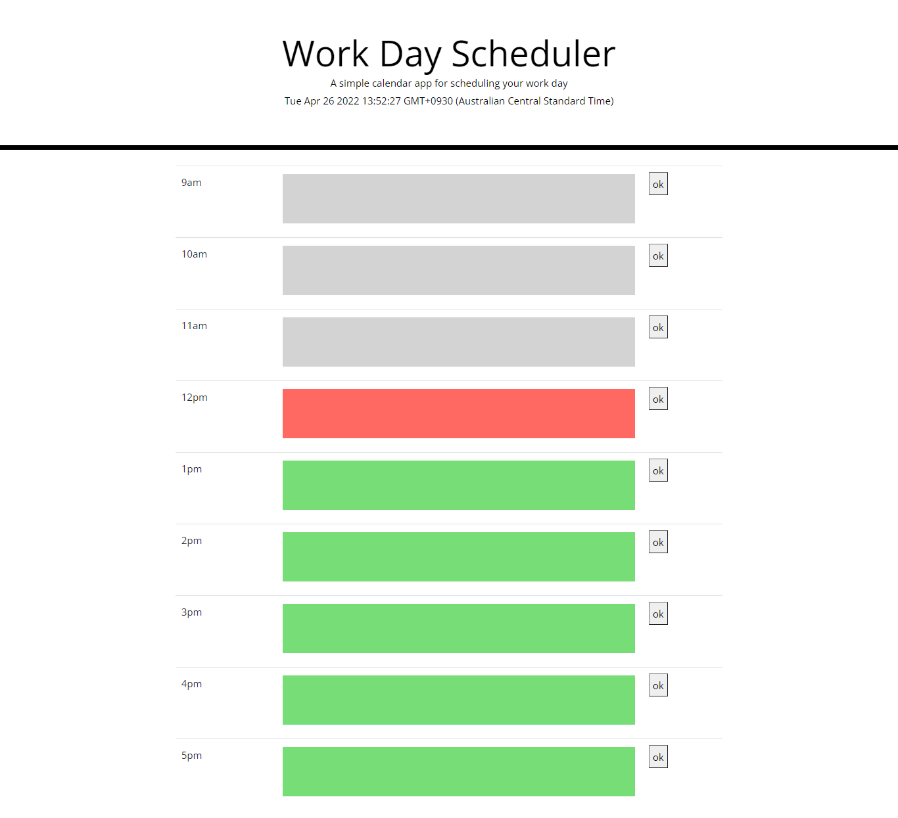

# calendar-application

 https://marcus-lopes.github.io/timed-quiz/

# Description

My motivation to start this project is to gain more experience for my career.

## Installation

-Initiation-

When I started this project, I had the intention of creating a calendar for my appointments.

# Usage

On this site we have a calendar application, when you enter the current day, month, year and time are given.

Below we have a table with hours from 9am to 5pm, to schedule appointments at these times.

Scheduled the appointment on time, when reloading the page it persists

# License
MIT License

Copyright (c) [2022] [MarcusLopes]

Permission is hereby granted, free of charge, to any person obtaining a copy of this software and associated documentation files (the "Software"), to deal in the Software without restriction, including without limitation the rights to use, copy, modify, merge, publish, distribute, sublicense, and/or sell copies of the Software, and to permit persons to whom the Software is furnished to do so, subject to the following conditions:

The above copyright notice and this permission notice shall be included in all copies or substantial portions of the Software.

THE SOFTWARE IS PROVIDED "AS IS", WITHOUT WARRANTY OF ANY KIND, EXPRESS OR IMPLIED, INCLUDING BUT NOT LIMITED TO THE WARRANTIES OF MERCHANTABILITY, FITNESS FOR A PARTICULAR PURPOSE AND NONINFRINGEMENT. IN NO EVENT SHALL THE AUTHORS OR COPYRIGHT HOLDERS BE LIABLE FOR ANY CLAIM, DAMAGES OR OTHER LIABILITY, WHETHER IN AN ACTION OF CONTRACT, TORT OR OTHERWISE, ARISING FROM, OUT OF OR IN CONNECTION WITH THE SOFTWARE OR THE USE OR OTHER DEALINGS IN THE SOFTWARE.

# Link Github
https://github.com/marcus-lopes/calendar-application